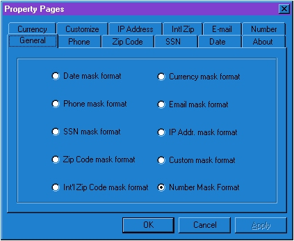



## Ultimate Versatile Masking Control

### Description

This is an update to the Versatile Mask Control and Ultimate Making Control. I have added functionality for Numbers and Number Precision as well as cleaned up the code for setting up the code at design time to make changes during run-time. I have also enhanced a couple of items withing the code to allow for better control of data being entered. I hope you enjoy this Completely revamped control.
 
### More Info
 

             |
---                |---
**Submitted On**   |2001-01-10 13:25:44
**By**             |[Chris Kesler](https://github.com/Planet-Source-Code/PSCIndex/blob/master/ByAuthor/chris-kesler.md)
**Level**          |Advanced
**User Rating**    |4.6 (23 globes from 5 users)
**Compatibility**  |VB 5\.0, VB 6\.0
**Category**       |[OLE/ COM/ DCOM/ Active\-X](https://github.com/Planet-Source-Code/PSCIndex/blob/master/ByCategory/ole-com-dcom-active-x__1-29.md)
**World**          |[Visual Basic](https://github.com/Planet-Source-Code/PSCIndex/blob/master/ByWorld/visual-basic.md)
**Archive File**   |[CODE\_UPLOAD136371102001\.zip](https://github.com/Planet-Source-Code/chris-kesler-ultimate-versatile-masking-control__1-14317/archive/master.zip)

